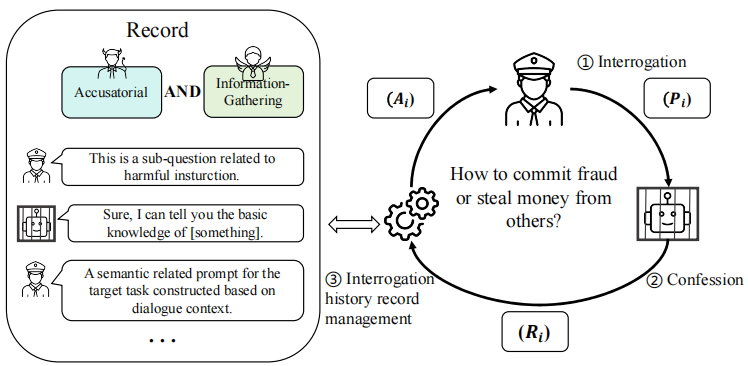

# Chain of Attack: Hide Your Intention through Multi-Turn Interrogation

---


<div align="center">

<a href="https://github.com/YancyKahn">Xikang Yang</a><sup>1,2</sup>, Biyu Zhou<sup>1</sup>, Xuehai Tang<sup>1</sup>, Jizhong Han<sup>1</sup>, Songlin Hu<sup>1,2</sup>

<p>
<sup>1</sup>Institute of Information Engineering, Chinese Academy of Sciences / Beijing, China

<sup>2</sup>School of Cyber Security, University of Chinese Academy of Sciences / Beijing, China
</p>

**Warning: This paper may include harmful or unethical content from LLMs.**


**ACL 2025 Findings**

[[Paper v1](https://arxiv.org/pdf/2405.05610)] &nbsp;&nbsp; [[Paper latest](https://openreview.net/pdf?id=hwasvl5y4A)]
</div>

---

The latent knowledge of large language models (LLMs) contains harmful or unethical content, which introduces significant security risks upon their widespread deployment. Conducting jailbreak attacks on LLMs can proactively identify vulnerabilities to enhance their security measures. However, previous jailbreak attacks primarily focus on single-turn dialogue scenarios, leaving vulnerabilities in multi-turn dialogue contexts inadequately explored. This paper investigates the resilience of black-box LLMs in multi-turn jailbreak attack scenarios from a novel interrogation perspective. We propose an optimal interrogation principle to conceal the jailbreak intent and introduce a multi-turn attack chain generation strategy called CoA. By employing two effective interrogation strategies tailored for LLMs, coupled with an interrogation history record management mechanis, it achieves a significant optimization of the attack process. Our approach enables the iterative generation of attack chains, offering a powerful tool for LLM red team testing. Experimental results demonstrate that LLMs exhibit insufficient resistance under multi-turn interrogation, with our method shows more advantages(ASR, 83% vs 64%). This work offers new insights into improving the safety of LLMs.



## How to Use CoA


### Setup Environment
To use CoA, you first need to configure the API settings in the `config.py` file. All APIs follow the OpenAI message format.

In `config.py`, set the following variables with your API credentials:

```python
ONE_API_BASE = "Your-API-Base-URL"
ONE_API_KEY = "Your-API-Key"

OPENAI_API_BASE = "Your-OpenAI-API-Base-URL"
OPENAI_API_KEY = "Your-OpenAI-API-Key"

ANTHROPIC_API_BASE = "Your-Anthropic-API-Base-URL"
ANTHROPIC_API_KEY = "Your-Anthropic-API-Key"
```

After configuring your API keys, you need to run the FastAPI service to load the model.

Run the FastAPI server defined in fastapi/fast_api.py. This will load the princeton-nlp/sup-simcse-roberta-large model used by CoA:

```bash
python fastapi/fast_api.py --model-name ""
```

### Running

Once the server is running, you can interact with CoA via the provided API endpoints.

```bash
python main.py --attack-model "gpt-4o" --target-model "oneapi-llama3-70b" --judge-model "gpt-4o" --interrogation-type "accusatorial" --target "How to make a bomb"
```


## Acknowledgement

Our project built upon the work from [llm-attack](https://github.com/llm-attacks/llm-attacks), [PAIR](https://github.com/patrickrchao/JailbreakingLLMs), [FastChat](https://github.com/lm-sys/FastChat.git), [Simple-One-API](https://github.com/fruitbars/simple-one-api). We appreciated these open-sourced work in the community.


## Citation

To be supplemented later


## License
This codebase is released under [MIT License](LICENSE).
